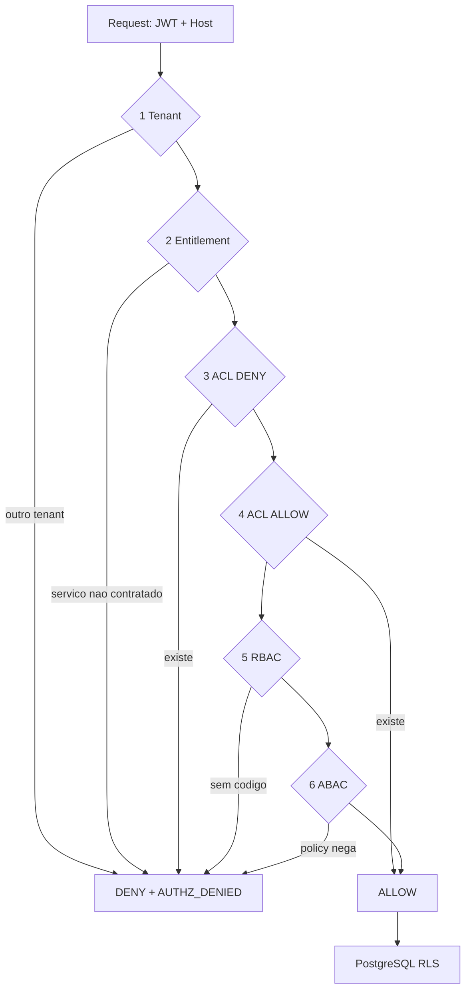

# HubSuite — Autorização (precedência única)

Toda decisão de acesso do Hub passa por **um** ponto: [`AuthorizationService`](../backend/src/shared/infrastructure/security/authorization.py). Rotas, handlers e serviços de domínio não reimplementam regra de acesso — eles pedem uma decisão.

Recortes: [RBAC.md](RBAC.md), [ACL.md](ACL.md), [ABAC.md](ABAC.md), [MULTI_TENANT.md](MULTI_TENANT.md). Mapa: [IAM.md](IAM.md).

| | |
|---|---|
| **Engine** | [security/authorization.py](../backend/src/shared/infrastructure/security/authorization.py) |
| **Adapters** | [security/authorization_adapters.py](../backend/src/shared/infrastructure/security/authorization_adapters.py) |
| **Entrada nas rotas** | `Depends(require_permission(...))` em [security/dependencies.py](../backend/src/shared/infrastructure/security/dependencies.py) |
| **Catálogo de códigos** | [security/permission_codes.py](../backend/src/shared/infrastructure/security/permission_codes.py) |

---

## 1. Precedência

A ordem é fixa no código e **não** é configurável. Nenhuma policy, ACL ou flag reordena os estágios.



| # | Estágio | Efeito | Observação |
|---|---------|--------|------------|
| 1 | `TENANT` | hard-fail | Recurso de outro tenant nunca é liberável — ACL e ABAC não sobrepõem |
| 2 | `ENTITLEMENT` | hard-fail | Serviço do código precisa estar contratado pelo tenant |
| 3 | `ACL` deny | nega | Deny explícito vence RBAC e ABAC |
| 4 | `ACL` allow | permite | Exceção por recurso; **curto-circuita** RBAC e ABAC de propósito |
| 5 | `RBAC` | permite/nega | Códigos efetivos (roles + bundles + exceções finas) |
| 6 | `ABAC` | só nega | Casbin/policies podem negar o que o RBAC concedeu; **não** concedem sozinhos na v1 |

O estágio 4 curto-circuita os seguintes porque é justamente para isso que existe: dar acesso a **um** recurso a **um** sujeito sem distribuir uma permissão global. O estágio 1 continua valendo, então uma ACL nunca vaza entre tenants.

RLS no PostgreSQL é a última linha: mesmo uma decisão errada do engine não enxerga linha de outro tenant.

---

## 2. API do engine

```python
decision = await authz.check(user=user, action="iam.users.update", resource=ref, context=ctx)
await authz.authorize(user=user, action=..., resource=ref)        # levanta ForbiddenError
await authz.authorize_all(user=user, actions=[...], resource=ref) # AND
await authz.authorize_any(user=user, actions=[...], resource=ref) # OR
```

- `Decision` traz `allowed`, `stage` e `reason` — o `stage` é o que explica a negativa nos logs e no audit.
- `ResourceRef(type, id, tenant_id, owner_id, attributes)` descreve o alvo. **Sem** `resource`, os estágios 3, 4 e 6 são omitidos: a checagem vira RBAC puro (é o caso do `require_permission` em rotas de coleção).
- `RequestContext(ip, user_agent, extra)` alimenta o ABAC com atributos de ambiente.

Toda negativa gera `AUTHZ_DENIED` no audit (ação, estágio, motivo, recurso, IP, `request_id`) — sem secrets no payload.

### Hierarquia de roles

`HierarchyPolicy` (no mesmo módulo) é a única definição da regra de privilégio: `PLATFORM > ADMIN > MANAGER > OPERATOR > CLIENT > VIEWER`, e quem gerencia precisa **superar estritamente** o alvo. Os guards de usuário/role/permissão resolvem os nomes das roles (dado) e delegam a decisão (regra).

---

## 3. RBAC: códigos, aliases e bundles

Formato canônico: `service.resource.action` (`iam.users.read`). O formato legado `resource.action` (`users.read`) **continua válido** — cada definição do catálogo carrega os dois, e `PermissionCode.expand()` garante que quem tem um tem o outro. A remoção dos aliases é um passo futuro explícito.

| Conceito | Onde |
|----------|------|
| Definição do código (canônico + legado + serviço) | `PermissionDefinition` |
| Mapa estável recurso → serviço | `SERVICE_BY_RESOURCE` |
| Bundles semeados (`iam.admin`, `platform.admin`, …) | `PERMISSION_BUNDLES` |
| Códigos exclusivos da plataforma | `PermissionCode.platform_only_codes()` |

Permissões efetivas de um usuário = códigos das roles + códigos dos **bundles** das roles (`role_permission_groups`), expandidos nos dois formatos. Bundles existem para que uma role seja "IAM admin", e não 40 checkboxes; `role_permissions` permanece para exceções finas.

O frontend nunca escreve código à mão: `frontend/src/constants/permissions.ts` é gerado por

```bash
cd backend && python -m scripts.generate_frontend_permissions
```

---

## 4. Entitlement

`service_for_permission(code)` resolve o serviço pelo namespace (3 segmentos) ou pelo mapa de recursos (2 segmentos). Serviço desconhecido faz o estágio **abster-se** — o RBAC segue valendo, o que mantém códigos de domínio novos funcionando antes de entrarem no catálogo.

O provider real (`CatalogEntitlementProvider`) consulta `tenant_services` com cache curto (~30s). Ver [SERVICE_HUB.md](SERVICE_HUB.md).

---

## 5. Regras para quem escreve código

1. Rota protegida sempre por `Depends(require_permission(PermissionCode.X))` — nunca `if user.role == "ADMIN"`.
2. Decisão que dependa do recurso (dono, tenant do recurso, ACL) usa `AuthorizationService.authorize(..., resource=ResourceRef(...))`.
3. Nenhum `try/except` engolindo `ForbiddenError` para "tentar outro caminho".
4. Código novo entra em `permission_codes.py` (e em `SERVICE_BY_RESOURCE`, se o recurso é novo) antes de ser usado.
5. Guard de frontend é UX. A barreira é o backend.

Testes de referência: [test_authorization_service.py](../backend/tests/unit/shared/security/test_authorization_service.py) (unitário, estágio a estágio) e [test_authorization_matrix.py](../backend/tests/integration/test_authorization_matrix.py) (HTTP, matriz RBAC/ACL/tenant).
